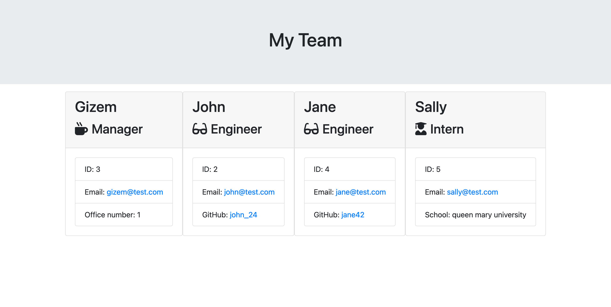

# Team Profile Generator

## Description

This is a Node.js command-line application which takes in information about employees on a software engineering team, then generate an HTML webpage that displays profiles for each person.

"Inquirer" package is used for collecting input from the user. "Jest" package is used for running tests.

## Table of Contents

- [Installation](#installation)
- [Usage](#usage)
- [License](#license)
- [Contributing](#contributing)
- [Questions](#questions)

## Installation

Run `npm install`

## Usage

Run `node index` and follow the instructions.

When you run the application you will see the following site on your browser:

## License

This project is using MIT license. You can view the license [here](license.txt).

## Contributing

Feel free to contribute!

## Questions

You can find me [here](https://github.com/gizem03)
